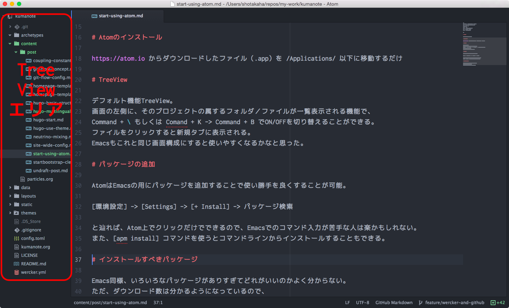
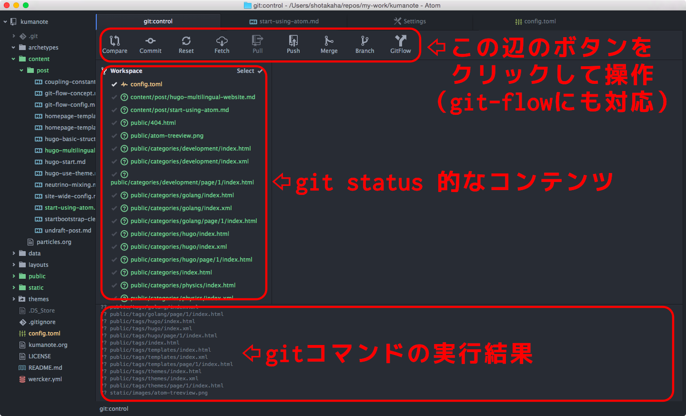
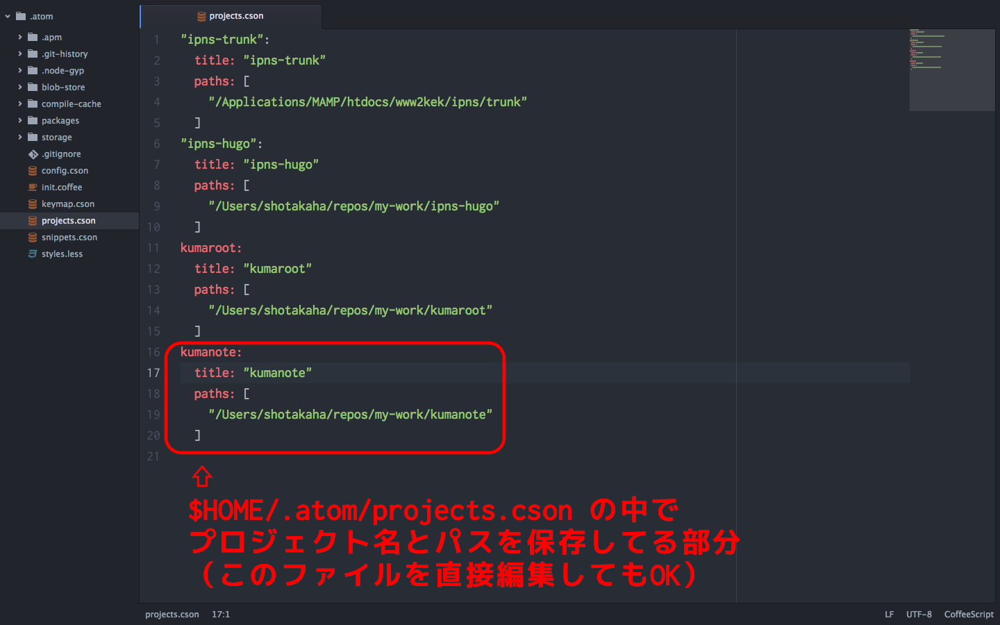

+++
categories = ["Development"]
date = "2015-12-30T20:16:08+09:00"
description = ""
draft = true
image = "/img/about-bg.jpg"
tags = ["hugo", "atom"]
title = "Atomを使い始めてみた"

+++

# Atomに浮気

年末休みなので`Emacs`から`Atom`に浮気してみた

# Atomのインストール

https://atom.io からダウンロードしたファイル（.app）を`/Applications/`以下に移動するだけ

# Core Packages

いわゆるビルトインのパッケージ。
デフォルトで割りと多くのパッケージがインストールされている。
不必要なパッケージは

[環境設定] -> [Setteings] -> [Packages] -> [Core Packages]

の一覧で`無効（Disable）`にできる。

## TreeView

デフォルト機能TreeView。
画面の左側に、そのプロジェクトの属するフォルダ／ファイルが一覧表示される機能で、
`Command + \` もしくは `Comand + K -> Command + B` でON/OFFを切り替えることができる。
ファイルをクリックすると新規タブに表示される。
Emacsもこれと同じ画面構成にすると使いやすくなるかなと思った。

# パッケージの追加

AtomはEmacsの用にパッケージを追加することで使い勝手を良くすることが可能。

[環境設定] -> [Settings] -> [+ Install] -> パッケージ検索

と辿れば、Atom上でクリックだけでできるので、Emacsでのコマンド入力が苦手な人は楽かもしれない。
また `apm install` コマンドを使うとコマンドラインからインストールすることもできる。

# 追加したパッケージ

Emacs同様、いろいろなパッケージがありすぎてどれがいいのかよく分からない。
ただ、ダウンロード数は分かるようになっているので、
とりあえず、ググッて得た口コミとそれ（ダウンロード数）を目安にしてみる。

## Git Control

ぐぐる先生に伺ったところ、GitHub製のくせにそのままだとGit機能は貧弱らしい。
なので https://atom.io/packages/git-control を追加した。

## Project Manager

Emacsの`persp-mode`みたいな機能。
Gitで管理しているプロジェクト毎に登録しておくと、
それらを簡単に切り替えることができるようになる。
登録はAtom上からでき、その一覧は`$HOME/.atom/projects.cson`に保存される。
なので、このファイルを直接編集してもOK。

